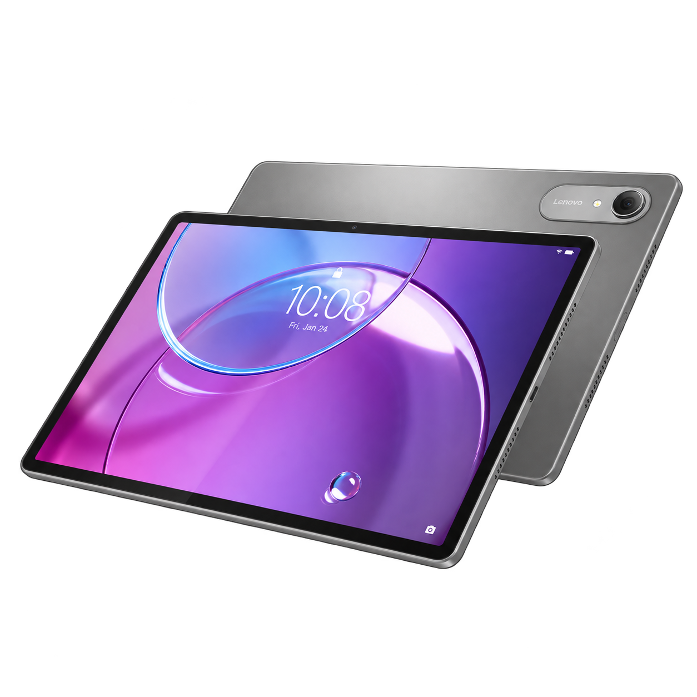

# Device tree for Lenovo Idea Tab Pro 2 (`malbec`)

  

## Device specifications

| Component | Specification |
| :--- | :--- |
| Model | Lenovo Idea Tab Pro Gen 2 (TB390FU) |
| Codename | `malbec` |
| SoC | Qualcomm Snapdragon 8s Gen 4 (SM8735P) |
| CPU | Octa-core: 1× Cortex-X4 at 3.2 GHz, 3× Cortex-A720 at 3.0 GHz, 2× Cortex-A720 at 2.8 GHz, 2× Cortex-A720 at 2.0 GHz |
| GPU | Adreno 825 |
| Memory | 8 / 12 GB LPDDR5X |
| Storage | 128 GB UFS 3.1 / 256 or 512 GB UFS 4.0; microSD up to 2 TB |
| Display | 13-inch IPS LCD, 3504 × 2190, 144 Hz, 16:10 |
| Battery | 10,200 mAh; 45 W charging |
| Rear camera | 13 MP, autofocus, flash |
| Front camera | 8 MP, fixed focus |
| Audio | Four JBL speakers, Dolby Atmos; dual microphones |
| Connectivity | Wi-Fi 7, Bluetooth 6.0 |
| Ports | USB-C (5 Gbps, DisplayPort output, audio and charging), microSD, 3-pin keyboard connector |
| Dimensions | 296.48 × 191.91 × 6.20 mm |
| Weight | Approximately 598 g |
| Shipped Android version | Android 16 |
| Shipped kernel version | Linux 6.6.87 |

Hardware configurations vary by region. Specifications: [Lenovo PSREF](https://psref.lenovo.com/syspool/Sys/PDF/Lenovo_Tablets/Idea_Tab_Pro_Gen_2/Idea_Tab_Pro_Gen_2_Spec.pdf).

## Regional names

This tablet family is also sold under the following names:

- [Motorola Moto Pad 70 Pro](https://www.motorola.in/moto-pad-70-pro/p) — India.
- [Lenovo Xiaoxin Pad Pro 13](https://club.lenovo.com.cn/forum.php?mod=viewthread&tid=9487028) — China.
- [Lenovo Tab K13](https://support.lenovo.com/us/en/solutions/ht501098) — listed by Lenovo alongside the Idea Tab Pro Gen 2 as TB390FU.
